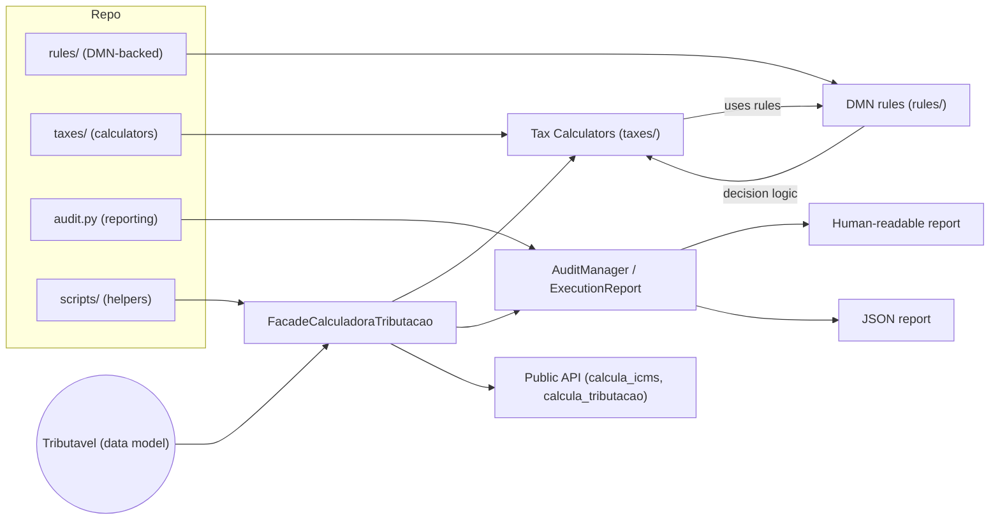
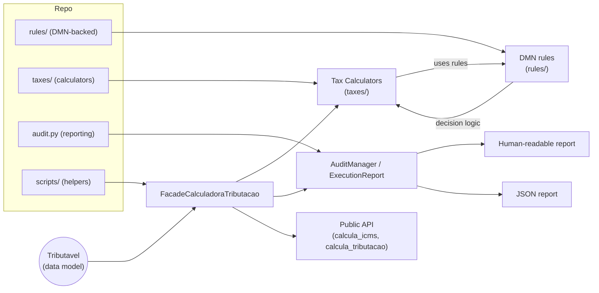

# motor_tributario_py

A lightweight, Python-native tax calculation library for Brazilian fiscal rules (ICMS, IPI, PIS/COFINS, FCP, DIFAL, ICMS ST and more).

This repository provides calculators and a facade to reproduce common fiscal calculation flows used by Brazilian electronic invoices (NF-e, NFC-e, CT-e) and related documents.

> [!NOTE]
> motor_tributario_py is part of the SPEDIR project — the Brazilian Localization for ERPNext. See the documentation and related resources at https://github.com/techmaxsolucoes/SPEDIR-DOCS


## Features

- Calculators for ICMS, ICMS ST, IPI, PIS, COFINS, FCP, DIFAL, IBPT and CBS/IBS flows
- A Facade (`FacadeCalculadoraTributacao`) that composes calculators into a single, test-friendly API
- Auditable execution traces via `debug_execution` for troubleshooting and tests
- Designed for deterministic unit testing and integration with decision tables (DMN)

## Architecture

A simplified diagram showing how data and decisions flow through the package.



- `Tributavel` is the single data holder for item/document values and percentages.
- `FacadeCalculadoraTributacao` orchestrates the calculators and consults DMN-backed rule tables when necessary.
- `rules/` contains DMN-style rule definitions consulted via `bkflow-dmn`.
- `taxes/` implements numeric calculations; `audit.py` captures evaluation traces and produces both human-readable and JSON reports.
- `scripts/` contains utilities used to generate embedded documentation and debug examples.
    percentual_icms=Decimal('18.0'),
    percentual_pis=Decimal('1.65'),
    percentual_cofins=Decimal('7.6'),
)

facade = FacadeCalculadoraTributacao(produto)
res_icms = facade.calcula_icms()
print('ICMS Base:', res_icms.base_calculo)
print('ICMS Valor:', res_icms.valor)

# Composite result with many taxes
resultado = facade.calcula_tributacao()
print('Valor PIS:', resultado.valor_pis)
print('Valor COFINS:', resultado.valor_cofins)

# Audit/debug example
report = facade.debug_execution('calcula_icms')
print(report.format_pretty())
```

## Audit/debug example output (pretty)

```text
================================================================================
EXECUTION REPORT: calcula_icms
================================================================================

INPUTS:
  args: ()
  kwargs: {}

  Tributavel:
    valor_produto: 100.00
    quantidade_produto: 1
    tipo_desconto: Incondicional
    percentual_icms: 18.0
    percentual_pis: 1.65
    percentual_cofins: 7.6

DECISION TRACE:

  [1] Full ICMS Calculation Rules
      Total Rules: 4
      Matched: [3]

      ━━━ Rule #4 ━━━
      Input Conditions:
        • is_ativo: false
        • tipo_desconto: "Incondicional"
      Output Calculations:
        • base_calculo = ( ( ( ( (valor_produto * quantidade_produto) + frete) + seguro) + outras_despesas) - desconto ) * (decimal(1) - (percentual_reducao / decimal(100)))
          Evaluated: ( ( ( ( (100.00 * 1) + 0) + 0) + 0) - 0 ) * (decimal(1) - (0 / decimal(100)))
          → Result: 100.00
        • valor_final = ( ( ( ( ( ( (valor_produto * quantidade_produto) + frete) + seguro) + outras_despesas) - desconto ) * (decimal(1) - (percentual_reducao / decimal(100))) ) * percentual_icms) / decimal(100)
          Evaluated: ( ( ( ( ( ( (100.00 * 1) + 0) + 0) + 0) - 0 ) * (decimal(1) - (0 / decimal(100))) ) * 18.0) / decimal(100)
          → Result: 18.000

FINAL RESULT:
  base_calculo: 100.00
  valor: 18.000
  percentual_icms: 18.0
  percentual_reducao: 0
  percentual_icms_st: 0
  percentual_mva: 0
  base_calculo_st: None
  valor_icms_st: None
  percentual_reducao_st: 0.00
  percentual_diferimento: 0.00
  valor_icms_diferido: None
  valor_icms_operacao: None
  valor_bc_st_retido: 100.00
  base_calculo_icms_efetivo: None
  valor_icms_efetivo: None
  modalidade_determinacao_bc_icms: ValorOperacao
  modalidade_determinacao_bc_icms_st: None

================================================================================
```

## Audit/debug example output (JSON)

```json
{
  "method_name": "calcula_icms",
  "inputs": {
    "tributavel": {
      "valor_produto": 100.0,
      "frete": 0.0,
      "seguro": 0.0,
      "outras_despesas": 0.0,
      "desconto": 0.0,
      "valor_ipi": 0.0,
      "quantidade_produto": 1.0,
      "is_servico": false,
      "is_ativo_imobilizado_ou_uso_consumo": false,
      "tipo_desconto": "Incondicional",
      "cst": "",
      "tipo_calculo_icms_desonerado": "",
      "crt": "",
      "tipo_operacao": "",
      "tipo_pessoa": "",
      "percentual_icms": 18.0,
      "percentual_reducao": 0.0,
      "percentual_ipi": 0.0,
      "percentual_pis": 1.65,
      "percentual_reducao_pis": 0.0,
      "percentual_cofins": 7.6,
      "percentual_reducao_cofins": 0.0,
      "percentual_icms_st": 0.0,
      "percentual_mva": 0.0,
      "percentual_reducao_st": 0.0,
      "percentual_fcp": 0.0,
      "percentual_fcp_st": 0.0,
      "percentual_credito": 0.0,
      "csosn": 0,
      "percentual_fcp_st_retido": 0.0,
      "valor_ultima_base_calculo_icms_st_retido": 0.0,
      "percentual_difal_interna": 0.0,
      "percentual_difal_interestadual": 0.0,
      "percentual_issqn": 0.0,
      "percentual_ret_pis": 0.0,
      "percentual_ret_cofins": 0.0,
      "percentual_ret_csll": 0.0,
      "percentual_ret_irrf": 0.0,
      "percentual_ret_inss": 0.0,
      "percentual_federal": 0.0,
      "percentual_estadual": 0.0,
      "percentual_municipal": 0.0,
      "percentual_federal_importados": 0.0,
      "percentual_ibs_uf": 0.0,
      "percentual_ibs_municipal": 0.0,
      "percentual_cbs": 0.0,
      "percentual_reducao_ibs_uf": 0.0,
      "percentual_reducao_ibs_municipal": 0.0,
      "percentual_reducao_cbs": 0.0,
      "documento": "",
      "percentual_icms_efetivo": 0.0,
      "percentual_reducao_icms_efetivo": 0.0,
      "quantidade_base_calculo_icms_monofasico": 0.0,
      "aliquota_ad_rem_icms": 0.0,
      "percentual_reducao_aliquota_ad_rem_icms": 0.0,
      "percentual_biodiesel": 0.0,
      "percentual_originario_uf": 0.0,
      "quantidade_base_calculo_icms_monofasico_retido_anteriormente": 0.0,
      "aliquota_ad_rem_icms_retido_anteriormente": 0.0,
      "somar_pis_na_base_ibs_cbs": false,
      "somar_cofins_na_base_ibs_cbs": false,
      "somar_icms_na_base_ibs_cbs": false,
      "somar_issqn_na_base_ibs_cbs": false,
      "percentual_diferimento": 0.0,
      "deduz_icms_da_base_de_pis_cofins": false
    },
    "args": [],
    "kwargs": {}
  },
  "result": {
    "base_calculo": 100.0,
    "valor": 18.0,
    "percentual_icms": 18.0,
    "percentual_reducao": 0.0,
    "percentual_icms_st": 0.0,
    "percentual_mva": 0.0,
    "base_calculo_st": null,
    "valor_icms_st": null,
    "percentual_reducao_st": 0.0,
    "percentual_diferimento": 0.0,
    "valor_icms_diferido": null,
    "valor_icms_operacao": null,
    "valor_bc_st_retido": 100.0,
    "base_calculo_icms_efetivo": null,
    "valor_icms_efetivo": null,
    "modalidade_determinacao_bc_icms": "ValorOperacao",
    "modalidade_determinacao_bc_icms_st": null
  },
  "audit_trail": {
    "traces": [
      {
        "table_title": "Full ICMS Calculation Rules",
        "facts": {
          "valor_produto": 100.0,
          "quantidade_produto": 1.0,
          "frete": 0.0,
          "seguro": 0.0,
          "outras_despesas": 0.0,
          "valor_ipi": 0.0,
          "is_ativo": false,
          "tipo_desconto": "Incondicional",
          "desconto": 0.0,
          "percentual_reducao": 0.0,
          "percentual_icms": 18.0
        },
        "matched_rules": [
          3
        ],
        "rule_count": 4,
        "final_result": [
          {
            "base_calculo": 100.0,
            "valor_final": 18.0
          }
        ],
        "matched_rule_details": [
          {
            "rule_number": 4,
            "input_conditions": {
              "is_ativo": "false",
              "tipo_desconto": "\"Incondicional\""
            },
            "output_calculations": {
              "base_calculo": {
                "expression": "( ( ( ( (valor_produto * quantidade_produto) + frete) + seguro) + outras_despesas) - desconto ) * (decimal(1) - (percentual_reducao / decimal(100)))",
                "evaluated": "( ( ( ( (100.00 * 1) + 0) + 0) + 0) - 0 ) * (decimal(1) - (0 / decimal(100)))",
                "result": 100.0
              },
              "valor_final": {
                "expression": "( ( ( ( ( ( (valor_produto * quantidade_produto) + frete) + seguro) + outras_despesas) - desconto ) * (decimal(1) - (percentual_reducao / decimal(100))) ) * percentual_icms) / decimal(100)",
                "evaluated": "( ( ( ( ( ( (100.00 * 1) + 0) + 0) + 0) - 0 ) * (decimal(1) - (0 / decimal(100))) ) * 18.0) / decimal(100)",
                "result": 18.0
              }
            }
          }
        ]
      }
    ]
  }
}
```

Notes:
- The `FacadeCalculadoraTributacao` accepts keyword overrides to `Tributavel` properties at construction time (handy for tests).
- Some flows rely on decision tables (DMN) to determine behaviour for specific CST/CSON rules. The package integrates with `bkflow-dmn` for that purpose.

## Project layout

- `motor_tributario_py/` - package sources
  - `facade.py` - high-level orchestration API
  - `models.py` - `Tributavel` data model used across calculators
  - `rules/` - DMN-backed rule dispatchers and helpers
  - `taxes/` - individual tax calculators (icms, pis, cofins, ipi, difal, etc.)
  - `utils/`, `audit.py` - helpers and auditing utilities

## Architecture

Diagrama simplificado mostrando o fluxo de dados e decisões dentro do pacote.



- `Tributavel` é o objeto de dados com valores e percentuais do item/documento.
- `FacadeCalculadoraTributacao` orquestra as chamadas aos calculadores e consulta tabelas de decisão quando necessário.
- `rules/` contém definições de regras estilo DMN consultadas via `bkflow-dmn`.
- `taxes/` implementa os cálculos numéricos; `audit.py` gera traços para depuração e relatórios em texto/JSON.
- `scripts/` contém utilitários usados para gerar a documentação embutida e exemplos de depuração.

## Tests

Unit tests and fixtures live under `tests/`. Run them with pytest:

```bash
pytest -q
```

## Contributing

Contributions are welcome. Open a PR with a clear description and tests for new calculations or bug fixes. Keep changes small and focused.

## License

Please refer to the repository LICENSE file for licensing information.

<!-- RULES-START -->

## Embedded rule sources
### credito_icms_rules.py
**Summary:** Credito ICMS Calculation

Source file: /home/maxwell/Rule/motor_tributario_py/motor_tributario_py/rules/credito_icms_rules.py


**Rule:** Credito ICMS Calculation
**Hit policy:** Unique

|Input: dummy|Output: valor_credito_icms|
|---|---|
|1|( ( base_calculo_credito * percentual_credito ) / decimal(100) )|


### csosn_rules.py
**Summary:** CSOSN Dispatch Rules

Source file: /home/maxwell/Rule/motor_tributario_py/motor_tributario_py/rules/csosn_rules.py


**Rule:** CSOSN Dispatch Rules
**Hit policy:** Unique

|Input: csosn|Output: calcular_icms_proprio|Output: calcular_icms_st|Output: calcular_credito|Output: calcular_efetivo|Output: modo_calculo|
|---|---|---|---|---|---|
|101|false|false|true|false|"Credito Only"|
|102|false|false|false|false|"Exempt"|
|103|false|false|false|false|"Exempt"|
|201|false|true|true|false|"Credito + ST"|
|202|false|true|false|false|"ST Only"|
|203|false|true|false|false|"ST Only"|
|300|false|false|false|false|"Exempt"|
|400|false|false|false|false|"Exempt"|
|500|false|false|false|true|"CSOSN 500 Efetivo"|
|900|true|true|true|false|"All (900)"|


### cst_post_processing_rules.py
**Summary:** CST Post-Processing Rules; CST 51 Diferimento Calculation

Source file: /home/maxwell/Rule/motor_tributario_py/motor_tributario_py/rules/cst_post_processing_rules.py


**Rule:** CST Post-Processing Rules
**Hit policy:** Unique

|Input: cst|Output: calcular_diferimento|Output: calcular_efetivo|Output: modo_post_processing|
|---|---|---|---|
|"51"|true|false|"Diferimento"|
|"60"|false|true|"Efetivo"|


**Rule:** CST 51 Diferimento Calculation
**Hit policy:** Unique

|Input: percentual_diferimento|Output: valor_icms_operacao|Output: valor_icms_diferido|Output: valor_final|
|---|---|---|---|
|> 0|(base_calculo * percentual_icms) / decimal(100)|(valor_icms_operacao * percentual_diferimento) / decimal(100)|valor_icms_operacao - valor_icms_diferido|


### cst_rules.py
**Summary:** CST Dispatch Rules

Source file: /home/maxwell/Rule/motor_tributario_py/motor_tributario_py/rules/cst_rules.py


**Rule:** CST Dispatch Rules
**Hit policy:** Unique

|Input: cst|Output: calcular_icms|Output: calcular_icms_st|Output: modo_calculo|
|---|---|---|---|
|"00"|true|false|"ICMS Only"|
|"10"|true|true|"ICMS + ST"|
|"20"|true|false|"ICMS with Reduction"|
|"30"|false|true|"ST Only"|
|"40"|false|false|"Exempt"|
|"41"|false|false|"Not Taxed"|
|"50"|false|false|"Suspension"|
|"51"|true|false|"Deferral"|
|"60"|false|false|"ST Already Collected"|
|"70"|true|true|"ICMS with Reduction + ST"|
|"90"|true|true|"Other"|


### difal_rules.py
**Summary:** Full DIFAL and FCP Calculation Rules

Source file: /home/maxwell/Rule/motor_tributario_py/motor_tributario_py/rules/difal_rules.py


**Rule:** Full DIFAL and FCP Calculation Rules
**Hit policy:** Unique

|Input: is_ativo|Input: tipo_desconto|Output: base_calculo|Output: valor_fcp|Output: valor_difal|Output: valor_icms_destino|Output: valor_icms_origem|
|---|---|---|---|---|---|---|
|true|"Condicional"|( ( ( ( ( (valor_produto * quantidade_produto) + frete) + seguro) + outras_despesas) + valor_ipi) + desconto )|( ( ( ( ( ( (valor_produto * quantidade_produto) + frete) + seguro) + outras_despesas) + valor_ipi) + desconto ) * percentual_fcp ) / decimal(100)|( ( ( ( ( ( (valor_produto * quantidade_produto) + frete) + seguro) + outras_despesas) + valor_ipi) + desconto ) * (percentual_difal_interna - percentual_difal_interestadual) ) / decimal(100)|( ( ( ( ( ( ( (valor_produto * quantidade_produto) + frete) + seguro) + outras_despesas) + valor_ipi) + desconto ) * (percentual_difal_interna - percentual_difal_interestadual) ) / decimal(100) )|decimal(0)|
|true|"Incondicional"|( ( ( ( ( (valor_produto * quantidade_produto) + frete) + seguro) + outras_despesas) + valor_ipi) - desconto )|( ( ( ( ( ( (valor_produto * quantidade_produto) + frete) + seguro) + outras_despesas) + valor_ipi) - desconto ) * percentual_fcp ) / decimal(100)|( ( ( ( ( ( (valor_produto * quantidade_produto) + frete) + seguro) + outras_despesas) + valor_ipi) - desconto ) * (percentual_difal_interna - percentual_difal_interestadual) ) / decimal(100)|( ( ( ( ( ( ( (valor_produto * quantidade_produto) + frete) + seguro) + outras_despesas) + valor_ipi) - desconto ) * (percentual_difal_interna - percentual_difal_interestadual) ) / decimal(100) )|decimal(0)|
|false|"Condicional"|( ( ( ( (valor_produto * quantidade_produto) + frete) + seguro) + outras_despesas) + desconto )|( ( ( ( ( (valor_produto * quantidade_produto) + frete) + seguro) + outras_despesas) + desconto ) * percentual_fcp ) / decimal(100)|( ( ( ( ( (valor_produto * quantidade_produto) + frete) + seguro) + outras_despesas) + desconto ) * (percentual_difal_interna - percentual_difal_interestadual) ) / decimal(100)|( ( ( ( ( ( (valor_produto * quantidade_produto) + frete) + seguro) + outras_despesas) + desconto ) * (percentual_difal_interna - percentual_difal_interestadual) ) / decimal(100) )|decimal(0)|
|false|"Incondicional"|( ( ( ( (valor_produto * quantidade_produto) + frete) + seguro) + outras_despesas) - desconto )|( ( ( ( ( (valor_produto * quantidade_produto) + frete) + seguro) + outras_despesas) - desconto ) * percentual_fcp ) / decimal(100)|( ( ( ( ( (valor_produto * quantidade_produto) + frete) + seguro) + outras_despesas) - desconto ) * (percentual_difal_interna - percentual_difal_interestadual) ) / decimal(100)|( ( ( ( ( ( (valor_produto * quantidade_produto) + frete) + seguro) + outras_despesas) - desconto ) * (percentual_difal_interna - percentual_difal_interestadual) ) / decimal(100) )|decimal(0)|


### fcp_rules.py
**Summary:** FCP Calculation

Source file: /home/maxwell/Rule/motor_tributario_py/motor_tributario_py/rules/fcp_rules.py


**Rule:** FCP Calculation
**Hit policy:** Unique

|Input: dummy|Output: valor_fcp|
|---|---|
|1|( ( base_calculo_icms * percentual_fcp ) / decimal(100) )|


### fcp_st_rules.py
**Summary:** FCP ST Calculation Rules; FCP ST Retido Calculation Rules

Source file: /home/maxwell/Rule/motor_tributario_py/motor_tributario_py/rules/fcp_st_rules.py


**Rule:** FCP ST Calculation Rules
**Hit policy:** Unique

|Input: tipo_desconto|Output: base_calculo_fcp_st|Output: valor_fcp_st|
|---|---|---|
|"Condicional"|( ( ( ( ( ( (valor_produto * quantidade_produto) + frete) + seguro) + outras_despesas) + valor_ipi) + desconto ) * ( decimal(1) + ( percentual_mva / decimal(100) ) ) )|( ( ( ( ( ( ( ( (valor_produto * quantidade_produto) + frete) + seguro) + outras_despesas) + valor_ipi) + desconto ) * ( decimal(1) + ( percentual_mva / decimal(100) ) ) ) ) * percentual_fcp_st ) / decimal(100)|
|"Incondicional"|( ( ( ( ( ( (valor_produto * quantidade_produto) + frete) + seguro) + outras_despesas) + valor_ipi) - desconto ) * ( decimal(1) + ( percentual_mva / decimal(100) ) ) )|( ( ( ( ( ( ( ( (valor_produto * quantidade_produto) + frete) + seguro) + outras_despesas) + valor_ipi) - desconto ) * ( decimal(1) + ( percentual_mva / decimal(100) ) ) ) ) * percentual_fcp_st ) / decimal(100)|


**Rule:** FCP ST Retido Calculation Rules
**Hit policy:** Unique

|Input: dummy|Output: base_calculo|Output: valor_fcp_st_retido|
|---|---|---|
|1|( valor_ultima_base_calculo_icms_st_retido * quantidade_produto )|( ( valor_ultima_base_calculo_icms_st_retido * quantidade_produto ) * percentual_fcp_st_retido ) / decimal(100)|


### ibpt_rules.py
**Summary:** IBPT Calculation Rules

Source file: /home/maxwell/Rule/motor_tributario_py/motor_tributario_py/rules/ibpt_rules.py


**Rule:** IBPT Calculation Rules
**Hit policy:** Unique

|Input: dummy|Output: base_calculo|Output: valor_federal|Output: valor_estadual|Output: valor_municipal|Output: valor_federal_importados|
|---|---|---|---|---|---|
|1|( (valor_produto * quantidade_produto) - desconto )|( ( ( (valor_produto * quantidade_produto) - desconto ) * percentual_federal ) / decimal(100) )|( ( ( (valor_produto * quantidade_produto) - desconto ) * percentual_estadual ) / decimal(100) )|( ( ( (valor_produto * quantidade_produto) - desconto ) * percentual_municipal ) / decimal(100) )|( ( ( (valor_produto * quantidade_produto) - desconto ) * percentual_federal_importados ) / decimal(100) )|


### ibs_cbs_rules.py
**Summary:** IBS/CBS Base Calculation; IBS Calculation; IBS Municipal Calculation; CBS Calculation

Source file: /home/maxwell/Rule/motor_tributario_py/motor_tributario_py/rules/ibs_cbs_rules.py


**Rule:** IBS/CBS Base Calculation
**Hit policy:** Unique

|Input: dummy|Output: base_calculo_ibs_cbs|
|---|---|
|1|( ( ( ( ( ( ( ( ( (valor_produto * quantidade_produto) + frete) + seguro) + outras_despesas) - desconto) + ajuste_pis) + ajuste_cofins) + ajuste_icms) + ajuste_issqn) )|


**Rule:** IBS Calculation
**Hit policy:** Unique

|Input: dummy|Output: valor_ibs|
|---|---|
|1|( ( base_calculo_ibs_cbs * ( percentual_ibs_uf * ( decimal(1) - ( percentual_reducao_ibs_uf / decimal(100) ) ) ) ) / decimal(100) )|


**Rule:** IBS Municipal Calculation
**Hit policy:** Unique

|Input: dummy|Output: valor_ibs_municipal|
|---|---|
|1|( ( base_calculo_ibs_cbs * ( percentual_ibs_municipal * ( decimal(1) - ( percentual_reducao_ibs_municipal / decimal(100) ) ) ) ) / decimal(100) )|


**Rule:** CBS Calculation
**Hit policy:** Unique

|Input: dummy|Output: valor_cbs|
|---|---|
|1|( ( base_calculo_ibs_cbs * ( percentual_cbs * ( decimal(1) - ( percentual_reducao_cbs / decimal(100) ) ) ) ) / decimal(100) )|


### icms_desonerado_rules.py
**Summary:** ICMS Desonerado Calculation Rules

Source file: /home/maxwell/Rule/motor_tributario_py/motor_tributario_py/rules/icms_desonerado_rules.py


**Rule:** ICMS Desonerado Calculation Rules
**Hit policy:** First

|Input: tipo_calculo|Input: cst_group|Output: valor_icms_desonerado|
|---|---|---|
|"BaseSimples"|"-"|( base_calculo * (percentual_icms / decimal(100)) )|
|"BasePorDentro"|"GroupA"|( ( ( subtotal_produto * ( decimal(1) - ( (percentual_icms / decimal(100)) * ( decimal(1) - (percentual_reducao / decimal(100)) ) ) ) ) / ( decimal(1) - (percentual_icms / decimal(100)) ) ) - subtotal_produto )|
|"BasePorDentro"|"GroupB"|( ( subtotal_produto / ( decimal(1) - (percentual_icms / decimal(100)) ) ) * (percentual_icms / decimal(100)) )|


### icms_efetivo_rules.py
**Summary:** ICMS Efetivo Base Calculation; ICMS Efetivo Calculation

Source file: /home/maxwell/Rule/motor_tributario_py/motor_tributario_py/rules/icms_efetivo_rules.py


**Rule:** ICMS Efetivo Base Calculation
**Hit policy:** Unique

|Input: tipo_desconto|Output: base_calculo_efetivo|
|---|---|
|"Condicional"|( ( ( ( ( ( valor_produto * quantidade_produto ) + frete ) + seguro ) + outras_despesas ) + desconto ) * ( decimal(1) - ( percentual_reducao_icms_efetivo / decimal(100) ) ) )|
|"Incondicional"|( ( ( ( ( ( valor_produto * quantidade_produto ) + frete ) + seguro ) + outras_despesas ) - desconto ) * ( decimal(1) - ( percentual_reducao_icms_efetivo / decimal(100) ) ) )|


**Rule:** ICMS Efetivo Calculation
**Hit policy:** Unique

|Input: dummy|Output: valor_icms_efetivo|
|---|---|
|1|( ( base_calculo_efetivo * percentual_icms_efetivo ) / decimal(100) )|


### icms_monofasico_rules.py
**Summary:** ICMS Monofásico Calculation

Source file: /home/maxwell/Rule/motor_tributario_py/motor_tributario_py/rules/icms_monofasico_rules.py


**Rule:** ICMS Monofásico Calculation
**Hit policy:** Unique

|Input: cst|Output: valor_icms_monofasico|Output: valor_icms_monofasico_retencao|Output: valor_icms_monofasico_operacao|Output: valor_icms_monofasico_diferido|Output: valor_icms_monofasico_retido_anteriormente|
|---|---|---|---|---|---|
|"02"|( quantidade_base_calculo_icms_monofasico * aliquota_ad_rem_icms )|decimal(0)|decimal(0)|decimal(0)|decimal(0)|
|"15"|( ( quantidade_base_calculo_icms_monofasico * ( decimal(1) - ( percentual_biodiesel / decimal(100) ) ) ) * ( aliquota_ad_rem_icms * ( decimal(1) - ( percentual_reducao_aliquota_ad_rem_icms / decimal(100) ) ) ) )|( ( ( quantidade_base_calculo_icms_monofasico * ( percentual_biodiesel / decimal(100) ) ) * aliquota_ad_rem_icms ) * ( percentual_originario_uf / decimal(100) ) )|decimal(0)|decimal(0)|decimal(0)|
|"53"|( ( quantidade_base_calculo_icms_monofasico * aliquota_ad_rem_icms ) - ( ( quantidade_base_calculo_icms_monofasico * aliquota_ad_rem_icms ) * ( percentual_originario_uf / decimal(100) ) ) )|decimal(0)|( quantidade_base_calculo_icms_monofasico * aliquota_ad_rem_icms )|( ( quantidade_base_calculo_icms_monofasico * aliquota_ad_rem_icms ) * ( percentual_originario_uf / decimal(100) ) )|decimal(0)|
|"61"|decimal(0)|decimal(0)|decimal(0)|decimal(0)|( quantidade_base_calculo_icms_monofasico_retido_anteriormente * aliquota_ad_rem_icms_retido_anteriormente )|


### icms_rules.py
**Summary:** Full ICMS Calculation Rules

Source file: /home/maxwell/Rule/motor_tributario_py/motor_tributario_py/rules/icms_rules.py


**Rule:** Full ICMS Calculation Rules
**Hit policy:** Unique

|Input: is_ativo|Input: tipo_desconto|Output: base_calculo|Output: valor_final|
|---|---|---|---|
|true|"Condicional"|( ( ( ( ( (valor_produto * quantidade_produto) + frete) + seguro) + outras_despesas) + valor_ipi) + desconto ) * (decimal(1) - (percentual_reducao / decimal(100)))|( ( ( ( ( ( ( (valor_produto * quantidade_produto) + frete) + seguro) + outras_despesas) + valor_ipi) + desconto ) * (decimal(1) - (percentual_reducao / decimal(100))) ) * percentual_icms) / decimal(100)|
|true|"Incondicional"|( ( ( ( ( (valor_produto * quantidade_produto) + frete) + seguro) + outras_despesas) + valor_ipi) - desconto ) * (decimal(1) - (percentual_reducao / decimal(100)))|( ( ( ( ( ( ( (valor_produto * quantidade_produto) + frete) + seguro) + outras_despesas) + valor_ipi) - desconto ) * (decimal(1) - (percentual_reducao / decimal(100))) ) * percentual_icms) / decimal(100)|
|false|"Condicional"|( ( ( ( (valor_produto * quantidade_produto) + frete) + seguro) + outras_despesas) + desconto ) * (decimal(1) - (percentual_reducao / decimal(100)))|( ( ( ( ( ( (valor_produto * quantidade_produto) + frete) + seguro) + outras_despesas) + desconto ) * (decimal(1) - (percentual_reducao / decimal(100))) ) * percentual_icms) / decimal(100)|
|false|"Incondicional"|( ( ( ( (valor_produto * quantidade_produto) + frete) + seguro) + outras_despesas) - desconto ) * (decimal(1) - (percentual_reducao / decimal(100)))|( ( ( ( ( ( (valor_produto * quantidade_produto) + frete) + seguro) + outras_despesas) - desconto ) * (decimal(1) - (percentual_reducao / decimal(100))) ) * percentual_icms) / decimal(100)|


### icms_st_rules.py
**Summary:** Full ICMS ST Calculation Rules

Source file: /home/maxwell/Rule/motor_tributario_py/motor_tributario_py/rules/icms_st_rules.py


**Rule:** Full ICMS ST Calculation Rules
**Hit policy:** Unique

|Input: tipo_desconto|Output: base_calculo_st|Output: valor_icms_st|
|---|---|---|
|"Condicional"|( ( ( ( ( ( ( (valor_produto * quantidade_produto) + frete) + seguro) + outras_despesas) + valor_ipi) + desconto ) * (decimal(1) - (percentual_reducao_st / decimal(100))) ) * (decimal(1) + (percentual_mva / decimal(100))) )|( ( ( ( ( ( ( ( ( (valor_produto * quantidade_produto) + frete) + seguro) + outras_despesas) + valor_ipi) + desconto ) * (decimal(1) - (percentual_reducao_st / decimal(100))) ) * (decimal(1) + (percentual_mva / decimal(100))) ) * percentual_icms_st ) / decimal(100) ) - valor_icms_proprio|
|"Incondicional"|( ( ( ( ( ( ( (valor_produto * quantidade_produto) + frete) + seguro) + outras_despesas) + valor_ipi) - desconto ) * (decimal(1) - (percentual_reducao_st / decimal(100))) ) * (decimal(1) + (percentual_mva / decimal(100))) )|( ( ( ( ( ( ( ( ( (valor_produto * quantidade_produto) + frete) + seguro) + outras_despesas) + valor_ipi) - desconto ) * (decimal(1) - (percentual_reducao_st / decimal(100))) ) * (decimal(1) + (percentual_mva / decimal(100))) ) * percentual_icms_st ) / decimal(100) ) - valor_icms_proprio|


### ipi_rules.py
**Summary:** Full IPI Calculation Rules

Source file: /home/maxwell/Rule/motor_tributario_py/motor_tributario_py/rules/ipi_rules.py


**Rule:** Full IPI Calculation Rules
**Hit policy:** Unique

|Input: tipo_desconto|Output: base_calculo|Output: valor_final|
|---|---|---|
|"Condicional"|( ( ( ( (valor_produto * quantidade_produto) + frete) + seguro) + outras_despesas) + desconto )|( ( ( ( ( (valor_produto * quantidade_produto) + frete) + seguro) + outras_despesas) + desconto ) * percentual_ipi) / decimal(100)|
|"Incondicional"|( ( ( ( (valor_produto * quantidade_produto) + frete) + seguro) + outras_despesas) - desconto )|( ( ( ( ( (valor_produto * quantidade_produto) + frete) + seguro) + outras_despesas) - desconto ) * percentual_ipi) / decimal(100)|


### issqn_rules.py
**Summary:** ISSQN Base Calculation; ISSQN Tax Calculation

Source file: /home/maxwell/Rule/motor_tributario_py/motor_tributario_py/rules/issqn_rules.py


**Rule:** ISSQN Base Calculation
**Hit policy:** Unique

|Input: tipo_desconto|Output: base_calculo|
|---|---|
|"Condicional"|( ( ( ( (valor_produto * quantidade_produto) + frete) + seguro) + outras_despesas) + desconto )|
|"Incondicional"|( ( ( ( (valor_produto * quantidade_produto) + frete) + seguro) + outras_despesas) - desconto )|


**Rule:** ISSQN Tax Calculation
**Hit policy:** Unique

|Input: calcular_retencoes|Output: valor_issqn|Output: valor_ret_pis|Output: valor_ret_cofins|Output: valor_ret_csll|Output: valor_ret_irrf|Output: valor_ret_inss|
|---|---|---|---|---|---|---|
|true|apply_threshold( ( ( base_calculo * percentual_issqn ) / decimal(100) ), 10 )|check_threshold( ( ( base_calculo * ( (percentual_ret_pis + percentual_ret_cofins) + percentual_ret_csll ) ) / decimal(100) ), 10, ( ( base_calculo * percentual_ret_pis ) / decimal(100) ) )|check_threshold( ( ( base_calculo * ( (percentual_ret_pis + percentual_ret_cofins) + percentual_ret_csll ) ) / decimal(100) ), 10, ( ( base_calculo * percentual_ret_cofins ) / decimal(100) ) )|check_threshold( ( ( base_calculo * ( (percentual_ret_pis + percentual_ret_cofins) + percentual_ret_csll ) ) / decimal(100) ), 10, ( ( base_calculo * percentual_ret_csll ) / decimal(100) ) )|apply_threshold( ( ( base_calculo * percentual_ret_irrf ) / decimal(100) ), 10 )|apply_threshold( ( ( base_calculo * percentual_ret_inss ) / decimal(100) ), 29 )|
|false|apply_threshold( ( ( base_calculo * percentual_issqn ) / decimal(100) ), 10 )|decimal(0)|decimal(0)|decimal(0)|decimal(0)|decimal(0)|


### pis_cofins_rules.py
**Summary:** Full PIS/COFINS Calculation Rules

Source file: /home/maxwell/Rule/motor_tributario_py/motor_tributario_py/rules/pis_cofins_rules.py


**Rule:** Full PIS/COFINS Calculation Rules
**Hit policy:** Unique

|Input: is_ativo|Input: deduz_icms|Input: tipo_desconto|Output: base_calculo|Output: valor_final|
|---|---|---|---|---|
|true|true|"Condicional"|( ( ( ( ( ( ( (valor_produto * quantidade_produto) + frete) + seguro) + outras_despesas) + valor_ipi) - valor_icms) * (decimal(1) - (percentual_reducao / decimal(100))) ) + desconto )|( ( ( ( ( ( ( ( (valor_produto * quantidade_produto) + frete) + seguro) + outras_despesas) + valor_ipi) - valor_icms) * (decimal(1) - (percentual_reducao / decimal(100))) ) + desconto ) * percentual_tax) / decimal(100)|
|true|true|"Incondicional"|( ( ( ( ( ( ( (valor_produto * quantidade_produto) + frete) + seguro) + outras_despesas) + valor_ipi) - valor_icms) * (decimal(1) - (percentual_reducao / decimal(100))) ) - desconto )|( ( ( ( ( ( ( ( (valor_produto * quantidade_produto) + frete) + seguro) + outras_despesas) + valor_ipi) - valor_icms) * (decimal(1) - (percentual_reducao / decimal(100))) ) - desconto ) * percentual_tax) / decimal(100)|
|true|false|"Condicional"|( ( ( ( ( ( ( (valor_produto * quantidade_produto) + frete) + seguro) + outras_despesas) + valor_ipi) ) * (decimal(1) - (percentual_reducao / decimal(100))) ) + desconto )|( ( ( ( ( ( ( ( (valor_produto * quantidade_produto) + frete) + seguro) + outras_despesas) + valor_ipi) ) * (decimal(1) - (percentual_reducao / decimal(100))) ) + desconto ) * percentual_tax) / decimal(100)|
|true|false|"Incondicional"|( ( ( ( ( ( ( (valor_produto * quantidade_produto) + frete) + seguro) + outras_despesas) + valor_ipi) ) * (decimal(1) - (percentual_reducao / decimal(100))) ) - desconto )|( ( ( ( ( ( ( ( (valor_produto * quantidade_produto) + frete) + seguro) + outras_despesas) + valor_ipi) ) * (decimal(1) - (percentual_reducao / decimal(100))) ) - desconto ) * percentual_tax) / decimal(100)|
|false|true|"Condicional"|( ( ( ( ( ( (valor_produto * quantidade_produto) + frete) + seguro) + outras_despesas) - valor_icms) * (decimal(1) - (percentual_reducao / decimal(100))) ) + desconto )|( ( ( ( ( ( ( (valor_produto * quantidade_produto) + frete) + seguro) + outras_despesas) - valor_icms) * (decimal(1) - (percentual_reducao / decimal(100))) ) + desconto ) * percentual_tax) / decimal(100)|
|false|true|"Incondicional"|( ( ( ( ( ( (valor_produto * quantidade_produto) + frete) + seguro) + outras_despesas) - valor_icms) * (decimal(1) - (percentual_reducao / decimal(100))) ) - desconto )|( ( ( ( ( ( ( (valor_produto * quantidade_produto) + frete) + seguro) + outras_despesas) - valor_icms) * (decimal(1) - (percentual_reducao / decimal(100))) ) - desconto ) * percentual_tax) / decimal(100)|
|false|false|"Condicional"|( ( ( ( ( ( (valor_produto * quantidade_produto) + frete) + seguro) + outras_despesas) ) * (decimal(1) - (percentual_reducao / decimal(100))) ) + desconto )|( ( ( ( ( ( ( (valor_produto * quantidade_produto) + frete) + seguro) + outras_despesas) ) * (decimal(1) - (percentual_reducao / decimal(100))) ) + desconto ) * percentual_tax) / decimal(100)|
|false|false|"Incondicional"|( ( ( ( ( ( (valor_produto * quantidade_produto) + frete) + seguro) + outras_despesas) ) * (decimal(1) - (percentual_reducao / decimal(100))) ) - desconto )|( ( ( ( ( ( ( (valor_produto * quantidade_produto) + frete) + seguro) + outras_despesas) ) * (decimal(1) - (percentual_reducao / decimal(100))) ) - desconto ) * percentual_tax) / decimal(100)|


<!-- RULES-END -->
